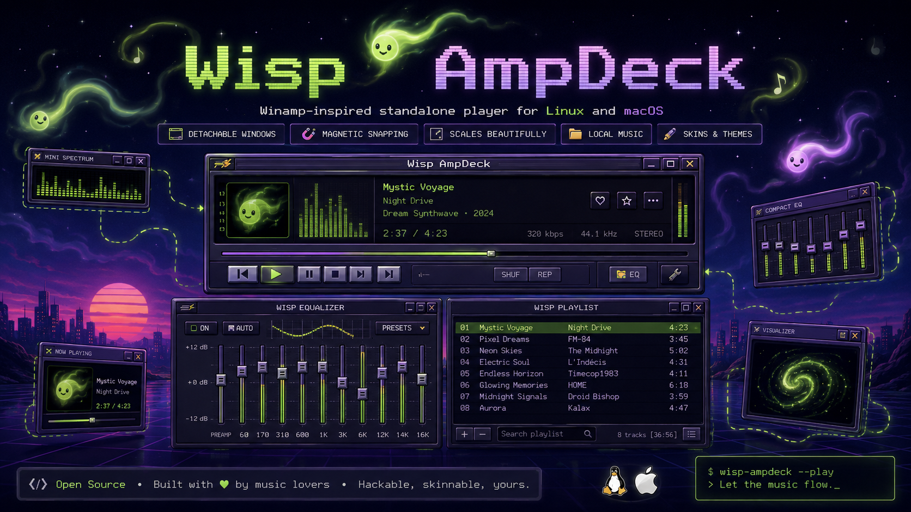

# Wisp AmpDeck



[Wisp AmpDeck](https://github.com/appatalks/wisp-ampdeck) is the **Winamp-Inspired Standalone Player** for Linux and macOS. It supports local music, detachable windows, magnetic snapping, scaling, and Winamp skins.

## Install

Linux x86-64:

```bash
curl -fsSL https://raw.githubusercontent.com/appatalks/wisp-ampdeck/main/install.sh | bash
```

The installer does not require `sudo`. Launch Wisp AmpDeck from the application menu, desktop shortcut, or with `wisp-ampdeck`.

Uninstall with:

```bash
wisp-ampdeck-uninstall
```

On macOS, open the release DMG and drag Wisp AmpDeck to Applications.

## Use

- Add files: `Ctrl/Cmd+O`
- Add a folder: `Ctrl/Cmd+Shift+O`
- Choose a skin: `Ctrl/Cmd+Shift+S`
- Scale the interface: `Ctrl/Cmd` with `+`, `-`, or `0`
- Show or hide the playlist: `Alt+E`
- View song details: click the scrolling song title

Drag the main title bar to move the deck. Drag the playlist or equalizer title bar to detach and snap that window.

Technical, development, and release documentation is available in [readme-2.md](readme-2.md).

## License

MIT. Wisp AmpDeck includes MIT-licensed [Webamp](https://github.com/captbaritone/webamp) code. See [NOTICE.txt](NOTICE.txt). Winamp and third-party skins may have separate rights.